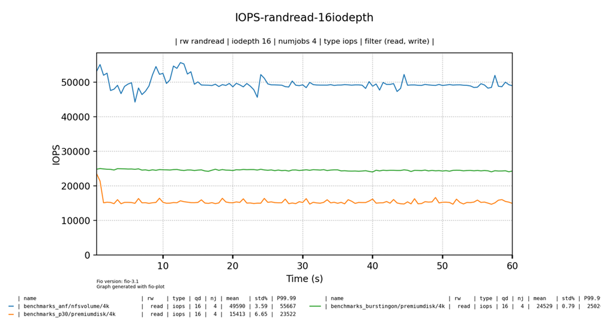
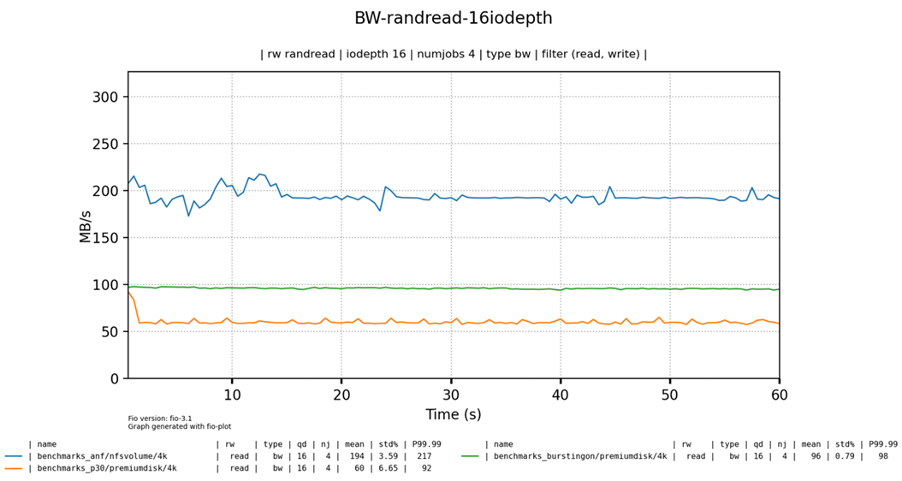
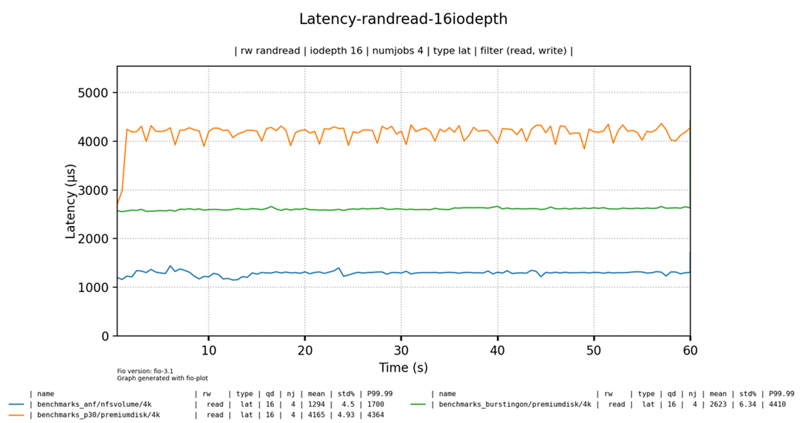

# Azure NetApp Files Terraform Demo


## Deploying Azure NetApp Files

This repo contains terraform files to deploy Azure NetApp Files inclusing below resources.

- Dedicated Host 
- Virtual Machine which can mounts NFS volume in Azure NetApp Files 
- 3 * P30 managed disks attached to the VM

To deploy resources specified in the terraform files, use below step.

```bash
# Set Environment variables for service principal to use. 
# Or you can use your azure credential by using "az login" instead of using service principal
export ARM_TENANT_ID="{Enter tenant ID here}"
export ARM_SUBSCRIPTION_ID="{Enter subscription ID here}"
export ARM_CLIENT_ID="{Enter service principal client id here}"
export ARM_CLIENT_SECRET="{Enter service principal secret here}"

# Run "terraform init" with terraform backend (Azure Blob Storage) configuration 
terraform init -backend-config="storage_account_name={Ener storage account name here}" -backend-config="container_name={Enter container name here}" -backend-config="Enter storage account key here" -backend-config="key={Enter blob name here}"

# Run "terraform plan"
terraform plan

# Run "terraform apply"
terraform apply
```

To mount Azure NetApp File volume on Azure VM, 

```bash
# On Ubuntu (Or On RHEL "sudo yum install -y nfs-utils")
sudo apt-get install nfs-common

# Check "mount path" in the portal and mount volume (e.g. when the mount path is "10.10.2.4:/mynfsvolumea")
sudo mount -t nfs -o rw,hard,rsize=65536,wsize=65536,sec=sys,vers=4.1,tcp 10.10.2.4:/mynfsvolume nfsvolume  

```


## Running Azure NetApp Files Performance Test

Azure NetApp Files provides following service level choices.

| **Service Level** | **Throughput per 1 TiB** | **IOPS per 1TiB @ 4K bs** |
| ----------------- | ------------------------ | ------------------------- |
| Ultra             | 128MiB/s                 | 32K                       |
| Premium           | 64MiB/s                  | 16K                       |
| Standard          | 16MiB/s                  | 4K                        |

* Up to 100 TiB Volume support
* Min 4TiB Capacity Pool, increments of 1TiB
* Protocol supported - SMB2.1/3.0, NFSv3/v4.1

To compare ANF performance with Azure managed disk, following test configurations are considered.

| **Test target volume**       | **Mount Path** | **Note**                                                     |
| ---------------------------- | -------------- | ------------------------------------------------------------ |
| ANF  (Premium Tier)          | /nfsvolume     | Mounted  using NFS v4.1                                      |
| Premium  Disk (bursting off) | /premiumdisk   | P30  * 3 e.a. (3TB volume with LVM)                          |
| Premium  Disk (bursting on)  | /premiumdisk   | P30  * 3 e.a. (3TB volume with LVM) with on-demand disk bursting enabled*. |

* "on-demand" bursting feature provides increased disk performance beyond original provisioned target. (Refer [Enable on-demand disk bursting - Azure Virtual Machines | Microsoft Docs](https://docs.microsoft.com/en-us/azure/virtual-machines/disks-enable-bursting?tabs=azure-powershell))

Below are test configuration.

- Target configuration
  - Dedicated Host SKU: ESv3-Type1
  - VM SKU: E64s_v3
  - ANF 
  - Service Level: Premium SKU
  - Volume Quota: 3T
  - Protocol Used: NFSv4.1

- Target Tool configuration
  - Performance Benchmark tool: [fio](https://fio.readthedocs.io/en/latest/fio_doc.html)
  - Virtualization Tool: https://github.com/louwrentius/fio-plot.git
  - Test parameters
    - IO depth: 16
    - Block Size: 4K
    - \# of jobs: 4
    - File Size per job: 10GB

To mount Premium disks on Azure VM, refer [Configure LVM on a virtual machine running Linux - Azure Virtual Machines | Microsoft Docs](https://docs.microsoft.com/en-us/previous-versions/azure/virtual-machines/linux/configure-lvm)

```bash
# Configure LVM on a Linux VM in Azure
# Install LVM
sudo apt-get update
sudo apt-get install lvm2

# Configure LVM
sudo pvcreate /dev/sd[cde]
sudo vgcreate data-vg01 /dev/sd[cde]
sudo lvcreate --extents 100%FREE --stripes 3 --name data-lv01 data-vg01
sudo mkfs -t ext4 /dev/data-vg01/data-lv01

# Add the new file system to /etc/fstab
sudo mkdir /premiumdisk

# Locate the logical volume path
lvdisplay
--- Logical volume ---
LV Path                /dev/data-vg01/data-lv01
....

# Add below line in "/etc/fstab"
/dev/data-vg01/data-lv01  /premiumdisk  ext4  defaults  0  2

# sudo mount -a

```


### Installing benchmark tools on VM

```
# Install fio
sudo apt update
sudo apt install fio

# clone https://github.com/louwrentius/fio-plot 
git clone https://github.com/louwrentius/fio-plot.git
cd fio-plot

# Install required python packages
sudo apt install python3-pip

cd fio_plot
pip3 install -r requirements.txt

cd ../benchmark_script
pip3 install -r requirements.txt

# Set access permission on the mounted paths.
sudo chmod 777 /nfsvolume  
sudo chmod 777 /premiumdisk
```


### Running fio benchmark on ANF  NFS volume

```bash
$ ./bench_fio -d /nfsvolume -t directory -s 10g --mode randread -o ./benchmarks_anf --iodepth 16 --numjobs 4 --block-size 4k --extra-opts fallocate=none

$ ./bench_fio -d /nfsvolume -t directory -s 10g --mode randwrite -o ./benchmarks_anf --iodepth 16 --numjobs 4 --block-size 4k --extra-opts fallocate=none

$ ./bench_fio -d /nfsvolume -t directory -s 10g --mode randrw --rwmixread 50 -o ./benchmarks_anf --iodepth 16 --numjobs 4 --block-size 4k --extra-opts fallocate=none

```


### Running fio benchmark on  Premium Disk (P30 * 3) LVM volume

```bash
# Test with on-demand bursting disabled (default)
$ ./bench_fio -d /premiumdisk -t directory -s 10g --mode randread -o ./benchmarks_pd --iodepth 16 --numjobs 4 --block-size 4k --extra-opts fallocate=none

$ ./bench_fio -d /premiumdisk -t directory -s 10g --mode randwrite -o ./benchmarks_pd --iodepth 16 --numjobs 4 --block-size 4k --extra-opts fallocate=none

$ ./bench_fio -d /premiumdisk -t directory -s 10g --mode randrw --rwmixread 50 -o ./benchmarks_pd --iodepth 16 --numjobs 4 --block-size 4k --extra-opts fallocate=none

# Stop the VM and enable on-demand bursting and then start the VM again

# Test with on-demand bursting enabled
$ ./bench_fio -d /premiumdisk -t directory -s 10g --mode randread -o ./benchmarks_pd_bursting --iodepth 16 --numjobs 4 --block-size 4k --extra-opts fallocate=none

$ ./bench_fio -d /premiumdisk -t directory -s 10g --mode randwrite -o ./benchmarks_pd_bursting --iodepth 16 --numjobs 4 --block-size 4k --extra-opts fallocate=none

$ ./bench_fio -d /premiumdisk -t directory -s 10g --mode randrw --rwmixread 50 -o ./benchmarks_pd_bursting --iodepth 16 --numjobs 4 --block-size 4k --extra-opts fallocate=none


```


### Getting and visualizing Test Result 

```bash
# go to "fio_plot" directory
cd ../fio_plot
# Create random read test results
# Create IOPS report 
 ./fio_plot -i ../benchmark_script/benchmarks_anf/data/4k ../benchmark_script/benchmarks_pd/data/4k ../benchmark_script/benchmarks_pd_bursting/data/4k -T "IOPS-randread-16iodepth" -g -t iops -r randread -d 16 -n 4 --xlabel-parent 2
 
# Create Bandwidth report 
 ./fio_plot -i ../benchmark_script/benchmarks_anf/data/4k ../benchmark_script/benchmarks_pd/data/4k ../benchmark_script/benchmarks_pd_bursting/data/4k -T "Bandwidth-randread-16iodepth" -g -t bw -r randread -d 16 -n 4 --xlabel-parent 2
 
# Create Latency report 
 ./fio_plot -i ../benchmark_script/benchmarks_anf/data/4k ../benchmark_script/benchmarks_pd/data/4k ../benchmark_script/benchmarks_pd_bursting/data/4k -T "Latency-randread-16iodepth" -g -t lat -r randread -d 16 -n 4 --xlabel-parent 2

# Create random write test results
# Create IOPS report 
 ./fio_plot -i ../benchmark_script/benchmarks_anf/data/4k ../benchmark_script/benchmarks_pd/data/4k ../benchmark_script/benchmarks_pd_bursting/data/4k -T "IOPS-randwrite-16iodepth" -g -t iops -r randwrite -d 16 -n 4 --xlabel-parent 2
 
# Create Bandwidth report 
 ./fio_plot -i ../benchmark_script/benchmarks_anf/data/4k ../benchmark_script/benchmarks_pd/data/4k ../benchmark_script/benchmarks_pd_bursting/data/4k -T "Bandwidth-randwrite-16iodepth" -g -t bw -r randwrite -d 16 -n 4 --xlabel-parent 2
 
# Create Latency report 
 ./fio_plot -i ../benchmark_script/benchmarks_anf/data/4k ../benchmark_script/benchmarks_pd/data/4k ../benchmark_script/benchmarks_pd_bursting/data/4k -T "Latency-randwrite-16iodepth" -g -t lat -r randwrite -d 16 -n 4 --xlabel-parent 2

```


### Below are my test results. 

IOPS - Random Read



Bandwidth - Random Read



Latency - Random Read




## Using RHEL8.4

```
sudo yum install -y git
sudo yum install -y nfs-utils
sudo yum -y install fio
sudo python3 -m pip install --upgrade pip
sudo python3 -m pip install --upgrade Pillow

git clone -b v.1.0.10 https://github.com/louwrentius/fio-plot.git
cd fio-plot/benchmark_script/
sudo pip3 install -r requirements.txt

# In case of ANF
sudo mkdir /nfsvolume
sudo mount -t nfs -o rw,hard,rsize=65536,wsize=65536,sec=sys,vers=4.1,tcp 10.10.2.4:/mynfsvolume2 /nfsvolume -o nconnect=8
sudo chmod a+wrx /nfsvolume/

./bench_fio -d /nfsvolume -t directory -s 4g --mode randread -o ./benchmarks_anf_ultra_nconnect8 --iodepth 64 --numjobs 4 --block-size 4k --extra-opts fallocate=none
./bench_fio -d /nfsvolume -t directory -s 4g --mode randwrite -o ./benchmarks_anf_ultra_nconnect8 --iodepth 64 --numjobs 4 --block-size 4k --extra-opts fallocate=none

cd ../fio_plot/
sudo pip3 install -r requirements.txt
./fio_plot -i ../benchmark_script/benchmarks_anf_ultra_nconnect8/nfsvolume/4k/ -T "IOPS-randread-64iodepth-4jobs-ANF-ultra-nconnect8" -g -t iops -r randread -d 64 -n 4 --xlabel-parent 2
./fio_plot -i ../benchmark_script/benchmarks_anf_ultra_nconnect8/nfsvolume/4k/ -T "latency-randread-64iodepth-4jobs-ANF-ultra-nconnect8" -g -t lat -r randread -d 64 -n 4 --xlabel-parent 2
./fio_plot -i ../benchmark_script/benchmarks_anf_ultra_nconnect8/nfsvolume/4k/ -T "bw-randread-64iodepth-4jobs-ANF-ultra-nconnect8" -g -t bw -r randread -d 64 -n 4 --xlabel-parent 2

sudo umount /nfsvolume/

# In case of managed disk
sudo parted /dev/sdc --script mklabel gpt mkpart xfspart xfs 0% 100%
sudo mkfs.xfs /dev/sdc1
sudo partprobe /dev/sdc1
sudo mkdir /datadrive
sudo mount /dev/sdc1 /datadrive

./bench_fio -d /ultradisk/ -t directory -s 4g --mode randread -o ./benchmark_ultradisk --iodepth 64 --numjobs 4 --block-size 4k --extra-opts fallocate=none

cd ../fio_plot/
sudo pip3 install -r requirements.txt
./fio_plot -i ../benchmark_script/benchmark_ultradisk/4k/ -T "IOPS-randread-64iodepth-4jobs-ultradisk" -g -t iops -r randread -d 64 -n 4 --xlabel-parent 2
./fio_plot -i ../benchmark_script/benchmark_ultradisk/4k/ -T "latency-randread-64iodepth-4jobs-ultradisk" -g -t lat -r randread -d 64 -n 4 --xlabel-parent 2
./fio_plot -i ../benchmark_script/benchmark_ultradisk/ultradisk/4k/ -T "bw-randread-64iodepth-4jobs-ultradisk" -g -t bw -r randread -d 64 -n 4 --xlabel-parent 2

```


## Summary

Azure NetApp Files provides NFS volume option for Azure Virtual Machine with better latency, IOPS, bandwidth performance than managed disk with same provisioned size. (Note that this performance is not limited by the IOPS limitation impose by VM SKU Size!)


## Reference

1) https://github.com/louwrentius/fio-plot.git
